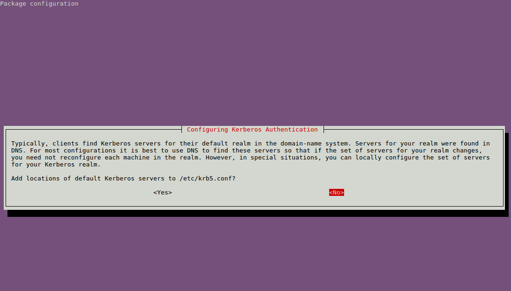

## Introduction

*(shamelessly taken from [wikipedia](https://en.wikipedia.org/wiki/Kerberos_(protocol)))*

Kerberos is a computer network authentication protocol that works on the basis of tickets to allow nodes communicating over a non-secure network to prove their identity to one another in a secure manner. 

Windows 2000 and later uses Kerberos as its default authentication method. Many UNIX and UNIX-like operating systems, including [FreeBSD](https://en.wikipedia.org/wiki/FreeBSD), Apple's [Mac OS X](https://en.wikipedia.org/wiki/Mac_OS_X), [Red Hat Enterprise Linux](https://en.wikipedia.org/wiki/Red_Hat_Enterprise_Linux), [Oracle](https://en.wikipedia.org/wiki/Sun_microsystems)'s [Solaris](https://en.wikipedia.org/wiki/Solaris_(operating_system)), IBM's [AIX](https://en.wikipedia.org/wiki/AIX) and [Z/OS](https://en.wikipedia.org/wiki/Z/OS), HP's [HP-UX](https://en.wikipedia.org/wiki/HP-UX) and [OpenVMS](https://en.wikipedia.org/wiki/OpenVMS) and others, include software for Kerberos authentication of users or services. 

Hence, we can use the protocol to have an OS independent solution for authentication across different databases. In this document, the installation and configuration for **linux/mac users** is provided as well as an introduction to the usage of the authentication service to connect to databases. For windows users (in the domain) the authentication is provided by default.

## Installation

### Libraries for authentification

For debian/ubuntu users (make sure you're `sudo`):

```
sudo apt install krb5-user libpam-krb5 libpam-ccreds auth-client-config
sudo apt-get install openssl
```

These libraries will be used later on. The following section if for interaction with MS SQL databases.

### MS SQL Server tools

As most of the databases at INBO are SQL Server, an appropriate driver and the command line toolset is required  to fully support database connections to SQL Server.

#### ODBC driver

Download and install the [Microsoft ODBC Driver for SQL Server](https://www.microsoft.com/en-us/download/details.aspx?id=53339).   The installation instructions for different linux flavours can be downloaded together with the ODBC driver. For `Ubuntu 16.04`,  following instructions apply:

```
sudo su
curl https://packages.microsoft.com/keys/microsoft.asc | apt-key add -
curl https://packages.microsoft.com/config/ubuntu/16.04/prod.list > /etc/apt/sources.list.d/mssqlrelease.list
exit
sudo apt-get update
sudo ACCEPT_EULA=Y apt-get install msodbcsql=13.1.4.0-1
sudo apt-get install unixodbc-dev
```

#### mssql-tools

Install the MS SQL tools as well:

* **sqlcmd**: Command-line query utility.
* **bcp**: Bulk import-export utility.

The instructions for different platforms are explained [here](https://docs.microsoft.com/en-us/sql/linux/sql-server-linux-setup-tools). In order to test the SQL connection later in this tutorial, add `/opt/mssql-tools/bin/` to your PATH environment variable.

You could also decide to go for the binaries: Download the binaries [here](Downloading => https://apt-mo.trafficmanager.net/repos/mssql-ubuntu-xenial-release/pool/main/m/mssql-tools/mssql-tools_14.0.1.246-1_amd64.deb) and install with:

```
dpkg -i mssql-tools_14.0.1.246-1_amd64.deb
```

### Configure Kerberos client

*(again, the commands assume sudo)*

Start with the kerberos configuration dialogue:

```
dpkg-reconfigure krb5-config
```
Use `INBO.BE` as the realm (this is the realm of the kerberos servers):


Make sure to use DNS to find these servers:


Next, adapt the `krb5.conf`, probably available in the `/etc` directory.  Add the following sections with configurations to the file:

```
[logging]
	default = FILE:/var/log/krblibs.log
	kdc = FILE:/var/log/krbkdc.log
	admin_server = FILE:/var/log/kadmind.log

[libdefaults]
	default_realm = INBO.BE
	dns_lookup_realm = false
	dns_lookup_kdc = true
	ticket_lifetime = 24h
	renew_lifetime = 7d
	forwardable=  true
```

In order to sync the timing of the domain controller server and client side, install `ntp`:

```
sudo apt-get install ntp
```
After installation, check if the following two files do exist: 
* `/etc/ntp.conf`
* `/etc/ntp.conf.dhcp` (empty file, just amke sure there is a file)

### Test installations

#### kerberos ticket system

To check if the Kerberos configuration is successfull, ask for a ticket by initiating with `kinit`:
```
kinit your_user_name
```

If no errors are prodused, check the existing tickets with `klist`:
```
klist
```
This should produce a list of successfully granted tickets, so something similar as:

```
Valid starting     Expires            Service principal
03/01/18 15:42:08  04/01/18 01:42:08  krbtgt/INBO.BE@INBO.BE
	renew until 10/01/18 15:42:08
```

#### SQL database connections

When the ticketing is working, the next step is to use the authentification to connect to the databases itself. For this test, we'll do thistest with the `sqlcmd` command line tool. In a next section, we'll focus on the ODBC settings.

Testing with `sqlcmd` (make sure you have an active ticket):

```
sqlcmd -S inbo-sql07-prd.inbo.be -E
1> Select top 10 name from sys.databases;
2> Go
```

### SQL ODBC connections

To support  database connections from other applications (e.g. GUI environments, but also R, Python,...), the configuration of database drivers and connections should be provided in the `/etc/odbc.ini` and `/etc/odbcinst.ini`.

Make sure the ODBC driver for SQL Server is available with a recognizable name in the `/etc/odbcinst.ini` file:
```
[ODBC Driver 13 for SQL Server]
Description=Microsoft ODBC Driver 13 for SQL Server
Driver=/opt/microsoft/msodbcsql/lib64/libmsodbcsql-13.1.so.4.0
UsageCount=2
```
At this moment, you can actually connect using typical ODBC libraries//packages provided by R or Python:

```python
import pyodbc
conn = pyodbc.connect("Driver={ODBC Driver 13 for SQL Server};Server=inbo-sql07-prd.inbo.be;Database=NBNData_IPT;Trusted_Connection=yes;")
```

However, it is probably easier to provide the configuration to specific databases directly, using the `/etc/odbc.ini` file. For example, the `NBNData_IPT` database can be defined as follows:

```
[nbn_ipt]
Driver      = ODBC Driver 13 for SQL Server
Description = INBOSQL07\PRD
Trace       = No
Server      = 172.16.203.57  #TODO ADAPT
Database    = NBNData_IPT
Port        = 1433
```

Next,  add the 

inbosql04.inbo.be


**TODO:**
-> example in R/Python
-> also available in Rstudio!


